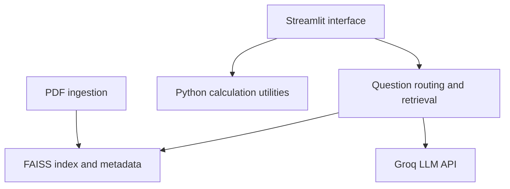
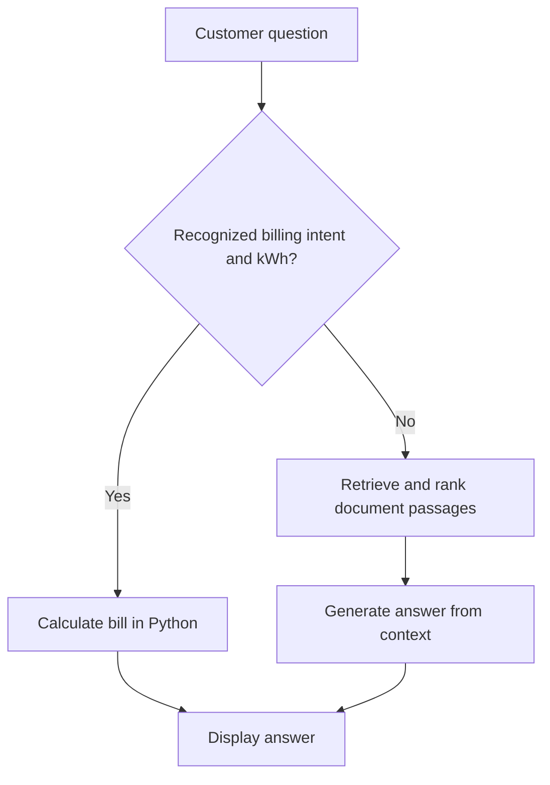
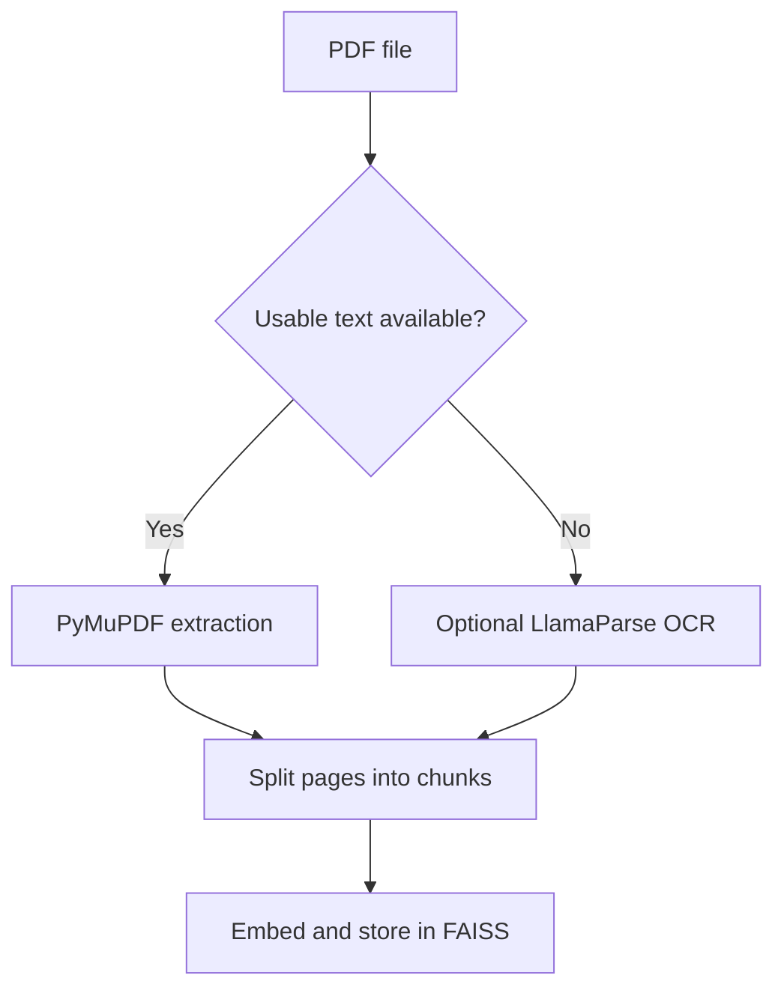

# Architecture and Processing Flows

These diagrams document the current source structure. They were prepared retrospectively from the implementation; they are not the original Draw.io deliverables.

## Components

## Question routing

`rag_pipeline.py` contains the routing and source-reference assembly. `utils.py` contains the deterministic calculations. The passage score uses vector distance; it is not an independent factual verification step.

## Document ingestion

## Functional boundaries

| Input | Processing | Output |
| --- | --- | --- |
| Question and chat context | Intent detection, retrieval and LLM call | Answer and source references |
| kWh and calculation parameters | Configured tariff rules | Bill breakdown |
| Appliance usage | Consumption formulas | Estimated use and charts |
| Solar assumptions | Output and financial calculations | Indicative payback estimate |
| PDF document | Extraction, chunking and embedding | Searchable document chunks |

The prototype does not retrieve personal customer records or submit requests to EVN systems.
